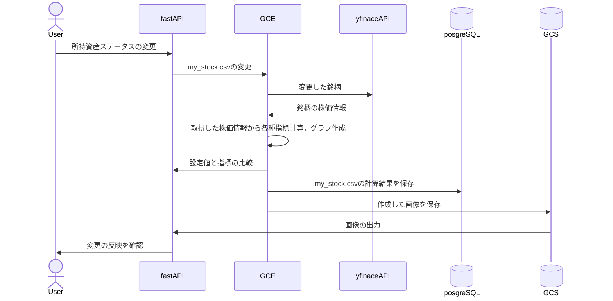

# アーキテクチャ

## 概要
（ここに現状構成を書く）
本システムは、ユーザーが保有する株式資産の管理と分析を目的としています。ユーザーはFastAPIを通じて資産情報を入力・更新し、バックエンドのGCE上で動作するPythonスクリプトがyfinance APIから株価情報を取得し、各種指標の計算とグラフの生成を行います。計算結果はPostgreSQLデータベースに保存され、生成されたグラフ画像はGCSに保存されます。最終的に、FastAPIがこれらの情報をユーザーに提供します。
## システム構成図


## 技術スタック
（言語 / FW / DB など）

- フロントエンド: FastAPI
- バックエンド: Python (GCE)
- データベース: PostgreSQL (Cloud SQL)
- ストレージ: GCS
- デプロイ: Cloud Run, GCE

## 機能モジュール

### 分析機能 (Analytics Service)

ポートフォリオの総資産額と評価損益を計算・提供する機能

**エンドポイント**: `GET /api/analytics/summary`

**パラメータ**:

- `portfolio_name` (optional): 分析対象のポートフォリオ名（デフォルト: "my_stock"）

**レスポンス**:

```json
{
  "portfolio_name": "my_stock",
  "total_assets": 1500000.0,
  "total_investment": 1200000.0,
  "unrealized_pnl": 300000.0,
  "unrealized_pnl_percent": 25.0,
  "last_updated": "2025-12-25T15:30:00"
}
```

**処理フロー**:

1. `Portfolio`テーブルから保有銘柄データを取得
2. yfinance APIを利用して各銘柄の最新株価を取得
3. 総資産額（現在評価額合計）を計算
4. 総投資額（購入金額合計）を計算
5. 評価損益（総資産額 - 総投資額）と評価損益率を計算
6. 結果を返却

**実装ファイル**:

- サービス層: `python/web/services/analytics.py`
- スキーマ定義: `python/web/schemas.py` (AnalyticsSummaryResponse)
- APIルーター: `python/web/routes/analytics.py`
- 依存モジュール: `python/analysis/portfolio_analyzer.py` (yfinance連携)
