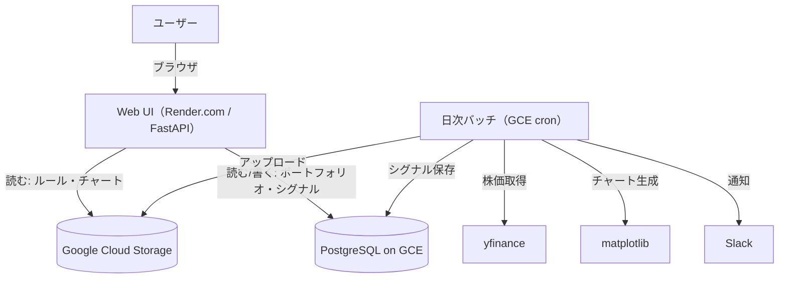

# 裁量トレード支援ツール開発記 — プロジェクト作成から本番デプロイまで

> 個人開発の日本株スイングトレード支援ツールを、約9ヶ月かけて「動くスクリプト群」から「クラウド上で常時稼働する Web サービス」へ育てた記録。
> 技術ブログ／ポートフォリオ用の素材としてまとめたもの。
>
> 期間: 2025-08-27（初コミット） 〜 2026-06-06（本番デプロイ完了） / コミット数: 274

---

## 1. プロジェクト概要

日本株のスイングトレードを対象とした **「裁量トレード支援システム」**。
「自動で売買して利益を出す Bot」ではなく、トレーダーが自分のルールに基づいて適切なタイミングで判断を下すための **監視・分析・記録を自動化** することを目的にしている。

設計上のこだわりは3点。

- **自動売買ではなく「支援」**: 最終判断は人間。システムは判断材料を整理し、ルール逸脱を監視する。
- **実運用前提**: 勉強用サンプルではなく、cron での常時監視・ルールの外部化・ログ記録を前提に設計。
- **スイングトレード特化**: デイトレのような高頻度ではなく、中期トレンドフォローを想定。

主な機能は、テクニカル指標（MACD / Bollinger Bands / RSI 等）の計算とシグナル検知、ブラウザで分析結果・チャートを閲覧する Web ダッシュボード、JSON ベースで損切り・利確ラインを調整できる設定 UI、そして「なぜルールを変えたか」を残すルール変更履歴管理。

---

## 2. 技術スタック

| レイヤ | 採用技術 |
| --- | --- |
| バックエンド | Python / FastAPI |
| フロントエンド | HTML + Vue.js（CDN）+ Jinja2 テンプレート |
| データ分析 | pandas / numpy / ta / yfinance / matplotlib |
| データベース | PostgreSQL（SQLAlchemy + Alembic） |
| ストレージ | Google Cloud Storage（ルール JSON・チャート画像・レポート） |
| 定期実行 | GCE（e2-micro）上の cron |
| Web ホスティング | Render.com（Docker デプロイ） |
| 通知 | Slack Webhook |
| CI/CD | GitHub Actions（Workload Identity Federation） |

「Always Free 枠に収める」ことを制約として設計しており、有償の Cloud SQL ではなく GCE インスタンス上で PostgreSQL を動かすなど、コストを抑える判断を随所で行っている。

---

## 3. 最終アーキテクチャ（責務分離型）

最終的に、**重い計算は GCE ワーカー、Web UI は Render の読み取り専用** という責務分離に落ち着いた。

ポイントは、Web UI が分析ロジックを一切持たず「GCS と DB を読むだけ」に徹していること。チャート生成のような重い処理は GCE 上の日次バッチに集約し、生成物を GCS 経由で UI に届ける。これにより Render の無料枠（メモリ 512MB）の制約を回避し、UI の応答性と安定性を確保している。

---

## 4. 開発の歩み（ざっくり時系列）

個人開発らしく、小さなスクリプトから機能を積み上げていった。

**フェーズ0: スクリプト群の時代（2025-08〜）**
データ収集（data_collector）、ポートフォリオ分析（portfolio_analyzer）、チャート生成（visualization）を、それぞれ単体で「とりあえず動く」状態に。CLI で叩く Python スクリプトの集合だった。

**フェーズ1: モジュール化と監視（watch）**
役割ごとにディレクトリを整理（data_collector はデータ収集だけ、analyze は分析だけ）。cron での常時監視を見据えた watch モジュールを実装。Slack 通知を追加し、定例タスクを report にまとめる。

**フェーズ2: 永続化とルールの外部化**
PostgreSQL + SQLAlchemy + Alembic を導入し、`stocks` / `daily_prices` / `signals` / `portfolio` 等のテーブル設計。トレードルールを `trading_rules.json` として外部化し、スキーマ（version / 有効フラグ / 数値の許容範囲）を確定。「UI ↔ JSON ↔ Python の完全一致」を目標にした。

**フェーズ3: Web UI（FastAPI + Vue.js）**
ダッシュボードと設定画面を実装。ルールの GET/POST を GCS 直結にし、チャートは GCS から配信。ルール変更時に理由（パフォーマンス最適化／リスク軽減／相場環境変化…）をプルダウンで選ばせ、変更履歴を必ず保存する仕組みを作った。

**フェーズ4: 運用・整備**
スイングトレード戦略の定数を `python/trading/rules/` に集約。Check Signal の安全化、削除済み銘柄の「幽霊表示」修正、トースト通知の改善など、実運用フィードバックを反映。MCP サーバ（watchlist + notes）も追加。

**フェーズ5: OSS 公開準備 → 本番デプロイ（2026-06）**
LICENSE 追加、ハードコードされた絶対パスの除去、機密情報の環境変数化、README 刷新。そして本記録の主役である **クラウド移行と本番デプロイ** へ。

---

## 5. 本番デプロイの道のり（ここが一番のドラマ）

「GCP 移行は完了済み、あとは localhost 確認して Render に上げるだけ」——そう思って始めたが、実際には **前提が崩れていた** ところから始まった。ここが一番のブログネタ。

### 5-1. 「移行済み」のはずが、ストレージが移っていなかった

新 GCP プロジェクトでバケット一覧を取ると **0 件**。データ本体のバケットは旧アカウント／旧プロジェクト側に残ったまま（バケット名は世界一意なので同名再作成も不可）だった。
→ 新プロジェクトに別名バケットを作り、旧→新へ直接コピー（69 ファイル、件数照合で一致確認）。コードにハードコードされていたバケット名は環境変数 `GCS_BUCKET_NAME` に統一した。

### 5-2. DB 移行——ダンプを開けたら「空」だった

新 VM には Postgres も Docker も無く、5432 で何も待ち受けていない＝ **DB は未構築**。旧 VM は「TERMINATED（停止中・削除はされていない）」だったため、起動して中を調査。

旧 VM には Docker コンテナの Postgres と **ネイティブの Postgres** が両方動いており、本番データはネイティブ側の `stock_db`（owner `stock_user`）にあった。`pg_dump` を取ると——**8.9KB、全テーブル 0 行**。実データは DB ではなく `data/` 配下の CSV と GCS にあり、DB は実質スキーマだけだったと判明。

→ 新 VM にネイティブ Postgres を導入し、ロール・DB を作成、スキーマダンプをリストア。後述するが、ここで `signals` テーブルが欠けていたことが後々効いてくる。

### 5-3. Cloud Run 前提のコードを Render へ

ドキュメントもコードも Cloud Run 前提で書かれていたが、公開先は Render.com に変更。`render.yaml` を新規作成し、Dockerfile（`$PORT` 対応済み）を流用。

Render 特有のブロッカーは2つあった。

- **GCS / Secret Manager 認証**: Render は GCP 外なので ADC（メタデータサーバ）が無い。サービスアカウント鍵を Render の Secret File として置き、`GOOGLE_APPLICATION_CREDENTIALS` で参照させて解決。
- **DB 接続経路**: Render から GCE のプライベート IP には到達できない。GCE Postgres を外部公開（`listen_addresses`・`pg_hba.conf` の `hostssl`）＋ SSL 接続にし、外部 IP を静的化（再起動で変わらないように）したうえで、ファイアウォールで Render の送信 IP に 5432 を許可。

### 5-4. デプロイ後に踏んだ地雷たち

無事デプロイ……と思いきや、ここから細かいエラーを順に潰していった。実務でありがちなものばかりで、教訓性が高い。

| 症状 | 原因 | 対処 |
| --- | --- | --- |
| トップページが 500 (`unhashable type: 'dict'`) | 依存を固定しておらず、Render が新しい Starlette を導入。`TemplateResponse` のシグネチャが「request 第1引数」に変わっていた | 呼び出しを新シグネチャ `TemplateResponse(request, "index.html")` に修正 |
| `Failed to load rules: Unexpected token '<'` | Render 無料枠のコールドスタート。起動中の HTML がフロントの API 呼び出しに返り JSON パース失敗 | スリープ復帰後は解消。挙動を理解して対処 |
| ルールがデフォルト値に化ける | GCS の `active.json` の `meta.version` が `"1.0.0"`（文字列）で、スキーマは整数を要求 | データ側を整数に修正 |
| DB 接続タイムアウト | Render の送信 IP をファイアウォールで未許可 | Render の Outbound IP を 5432 で許可 |
| GCS に書き込めない（GCE 側） | VM のアクセススコープが `devstorage.read_only` | 静的 IP 化のうえ VM を停止→スコープを `cloud-platform` に変更→起動 |
| 画像が更新されない | **生成は `data/chartImg/<period>/` に出力、配信は GCS の `charts/signals` を参照、しかも同期スクリプトは period サブディレクトリを見ていなかった** | 同期スクリプトを period 対応に修正＋古い画像の一掃処理を追加 |
| シグナルが保存されない | 復元ダンプに `signals` テーブルが無かった | `Base.metadata.create_all()` で不足テーブルを作成 |

特に「画像が更新されない問題」は、**生成側・同期側・配信側の3者でパスがすべて食い違っていた** という、個人開発で機能を継ぎ足していった結果ありがちな不整合で、原因特定に時間がかかった分だけ学びも大きかった。

---

## 6. 採用した解決策：責務分離アーキテクチャ（案B）

画像更新問題の本質は「重いチャート生成を Web 側（Render）で実行しようとしていた」こと。Render では (a) メモリ制約で落ちうる、(b) ローカルディスクは揮発する、(c) そもそも GCS にアップロードしていなかった、と三重に不利だった。

そこで、元の設計思想（Web UI は分析ロジックを持たない）に立ち返り、次の構成に整理した。

- **GCE ワーカー**: 日次バッチ（cron、平日 16:00 JST）で「GCS から現ポートフォリオ取得 → 全銘柄チャート生成 → GCS へ同期（古い画像は一掃してから現行をアップロード）→ シグナル分析を DB 保存」を実行。
- **Render の Web UI**: 環境変数 `DISABLE_CHART_GENERATION=1` で重い生成をスキップし、GCS と DB を読むだけに徹する。

この分離により、UI は軽量・安定なまま、データは GCE バッチが裏で更新し続ける形になった。スケール戦略としても素直で、将来計算層を別言語に切り出す布石にもなる。

---

## 7. 学び・ハマりどころ（教訓集）

- **「移行済み」を信じない**: バケットも DB も「完了したつもり」で実際は未完了だった。最初に `gcloud storage buckets list` や `\dt` で現物を確認すべきだった。
- **依存はピン留めする**: requirements を固定していなかったため、本番ビルドで最新 Starlette が入り `TemplateResponse` で 500。`works on my machine` の典型。
- **無料枠の特性を知る**: 外部 IPv4 課金、Render の無料 Postgres は 30 日で失効、無料 Web はスリープしコールドスタートする——コストと挙動は事前に調べる価値がある。
- **生成・保存・配信のパスは一本化する**: 同じ「チャート画像」を指すパスが3箇所でバラバラだった。データフローの単一の真実（source of truth）を決めるべき。
- **責務分離はトラブルシュートを楽にする**: Web と計算を分けたことで、どちらの層の問題かが切り分けやすくなった。
- **停止≠削除に救われた**: 旧 VM が TERMINATED（停止）で残っていたおかげでデータを回収できた。クラウドリソースは安易に削除しない運用が効いた。

---

## 8. 今後の展望

- **リファクタリング**: 現在は FastAPI モノリス。これを ver1 とし、将来的に「フロント = Next.js / API = Go / 計算 = Python」へ段階的に分割していく構想（一気にではなく、内部分離 → サービス化 → フロント切り出しの順で）。
- **仮想通貨対応**: Coincheck 等の API を取り込み、価格取得を抽象化して既存の指標・シグナル・チャートのパイプラインを再利用する。OHLC 履歴の確保と、24 時間市場に合わせた営業時間ロジックの分岐が論点。
- **OSS 整備**: `CONTRIBUTING.md` / `ARCHITECTURE.md` の整備、Alembic マイグレーションの整合（`alembic stamp head`）、UI の自己説明化など。

---

## まとめ

「動くスクリプト」を「常時稼働するサービス」にするまでには、機能実装そのものよりも **移行・認証・経路・パス整合といった“つなぎ込み”の地味な戦い** が大半を占めた。個人開発でありがちな「継ぎ足しによる不整合」を、責務分離という設計判断で整理しきったのが本プロジェクトの山場だった。クラウドの無料枠という制約の中で、現実的なトレードオフを選び続けた記録として残しておきたい。
